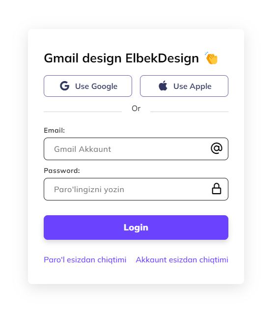

# Minimal Login Design
In this tutorial ([Open in Youtube](https://www.youtube.com/@elbekgameruz/featured)), I'm going to show you how to use modern HTML, CSS, and JavaScript to create a completely responsive login page. We'll be use CSS Flexbox and Media queries for our responsive design, and CSS  transitions for some cool animation effects. This Login design is responsive in all devices!

### Tutorial Video's

Find Video's on : <a href="https://www.youtube.com/@elbekgameruz/featured" target="_blank">ElbekDesign</a> Youtube Channel

# Screenshot
Here we have project screenshot :

